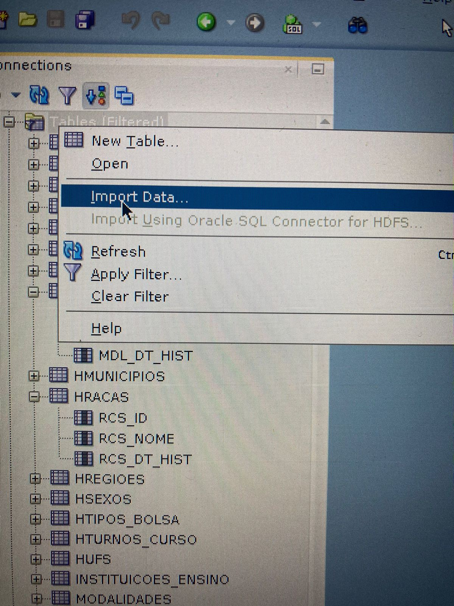
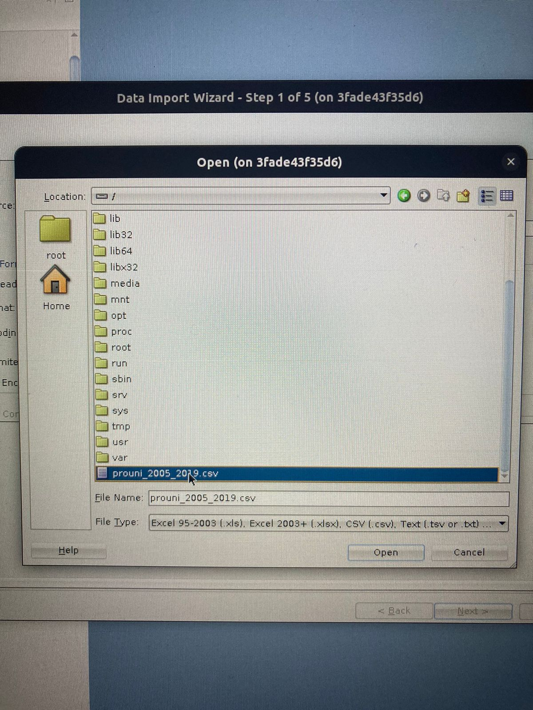

# Ambiente de desenvolvimento para matéria de Laboratório de banco de dados

Este repositório contém o necessário para a configuração do ambiente de desenvolvimento
do projeto de lab de banco

## Instalação: passo-a-passo

Para instalar o ambiente de desenvolvimento, siga os passos seguintes:

1. Clone esse repositório.

    - Caso tenha chave ssh configurada

        ``` bash
        $ git clone git@github.com:devkemc/fatec_lab_banco.git
        ``` 
    - Caso não tenha chave ssh configurada

        ``` shell
        $ git clone https://github.com/devkemc/fatec_lab_banco.git
        ``` 

2. Verifique se já tem o docker e o docker-compose instalado.
    <blockquote>A nova versão do docker já traz o compose</blockquote>    
3. Adicione o zip fornecido que contem o sql developer sqldeveloper-23.1.0.097.1607-no-jre.zip na pasta
   lab_banco/docker/sql_developer

    ``` bash
    $ cp <suas_pastas>/sqldeveloper-23.1.0.097.1607-no-jre.zip <suas_pastas>/lab_banco/docker/sql_developer
    ```

4. Acesse local onde o docker está configurado no projeto.

    ``` bash
    $ cd <suas_pastas>/lab_banco/docker
    ```
5. Execute o comando para habilitar interface gráfica do docker

    ``` bash
    $ xhost local:root
    ```
5. Execute o comando para a criação dos contâiners

    ``` bash
    $ docker compose up
    ```

- oracle-db-lab-banco: Contém o Oracle XE LTS;
- sql-developer-lab-banco: Contém o Oracle sql developer 23;

6. Acesse o sql developer com as seguintes configurações:
    - Conexão: Lab_banco
    - Hostname: db
    - Port: 1521
    - SID: xe
    - Username: system
    - Password: Oracle_123
7. Rodar scripts:
    1. Execute o sql presente no arquivo init.sql para criação do usuário.
    2. Execute o sql presente no arquivo tables.sql para criação das tabelas.
    3. Execute o sql presente no arquivo sequences.sql para criação das sequências
    4. Execute o sql presente no arquivo triggers.sql para criação das triggers. Esses terão de ser executados 1 a 1.
    5. Execute o sql presente no arquivo htriggers.sql para criação das triggers para alimentar as tabelas de
       historiamento.
    6. Execute o sql presente nos arquivos dentro do diretório procedures para criação das procedures que alimentarão o
       banco. Você deve executar as procedures que alimentam as tabelas de dependência primeiro.
        - Exemplo:
            * antes de executar a procedure de ufs, execute a de regiões.
        - OBB: a procedure de distribuicao_dados, deverá ser a ultima.
8. Alimentar banco de dados:
    - Antes de tudo é necessário executar o script python do arquivo limpa_csv.py, este arquivo irá retirar os dados que
      não de anos muito anteriores para alimentar o banco de dados.
    - Acesse sua conexão Lab_banco, vá até a "Tables", clique com o botão direito e selecione "Import Data":
      
    - Selecione o arquivo csv, ele estara no diretório /:
      
    - De o nome da tabela de PROUNI.
    - Selecione as colunas que deseja importar, no caso a de "idade" e "CODIGO_EMEC_IES..." não são necessários.
    - Selecione o tipo de dados para cada coluna, pode colocar varchar para todas.
    - Pronto agora os dados do csv serão importados para a tabela PROUNI.
9. Está na hora de alimentar suas tabelas:
   - Abra um arquivo para execução de sql, rode o seguinte sql:
        ```sql
        BEGIN
            DISTRIBUI_DADOS();
        END;
        ```
    - Pronto, agora é só esperar o processo terminar.
10. Verifique se os dados foram inseridos corretamente.
    - Abra cada tabela e verifique se os dados foram inseridos corretamente.
11. Faça um delete para que as dados sejam alimentados no historiamento:
    ```sql
    DELETE FROM BOLSAS WHERE BSL_ANO < 2019;
    ```
    - Verifique se os dados mais antigos foram para tabela de historiamento.
12. Auditoria:
    - Acesse o diretório de auditoria e execute o arquivo config. Irá criar um novo usuário:
    - Acesse o sql developer com as seguintes configurações:
        - Conexão: auditoria
        - Hostname: db
        - Port: 1521
        - SID: xe
        - Username: app_auditoria
        - Password: app123
    - Execute o sql presente no arquivo table-auditoria.sql para criação da tabela.
    - Execute o sql presente no arquivo sequence para criação da sequência para o id da tabela auditoria.
    - Execute o sql presente no arquivo procedure.sql para criação da procedure que irá alimentar a tabela de auditoria.
13. Retorne para conexão Lab_banco:
   - Execute todos os sqls nos arquivos com nome iniciado em trigger dentro do diretório auditoria, para criar as triggers de auditoria.
14. Pronto, agora é só testar.